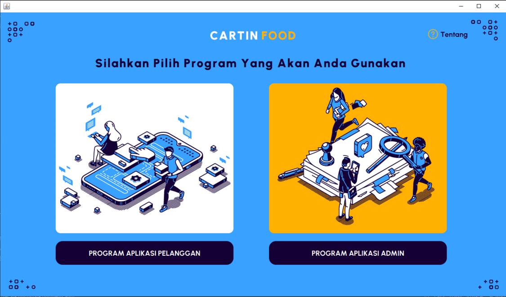
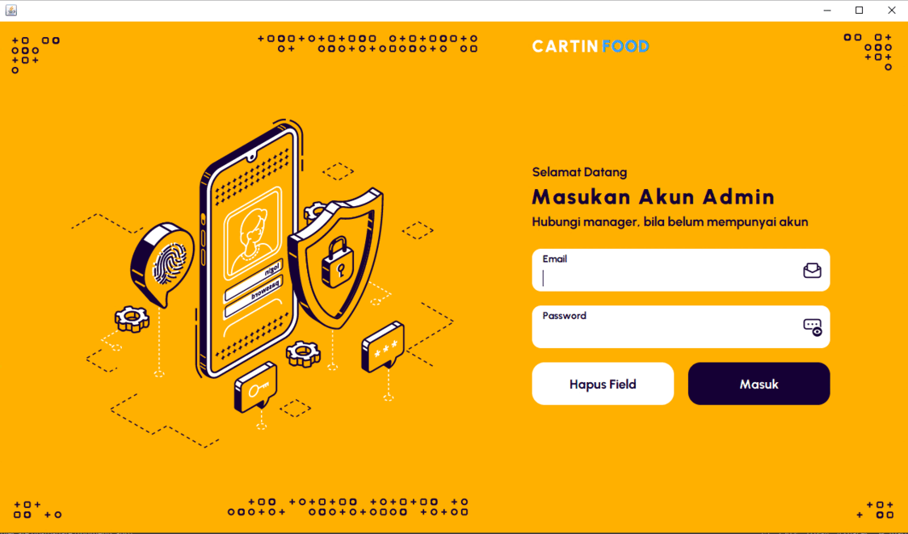
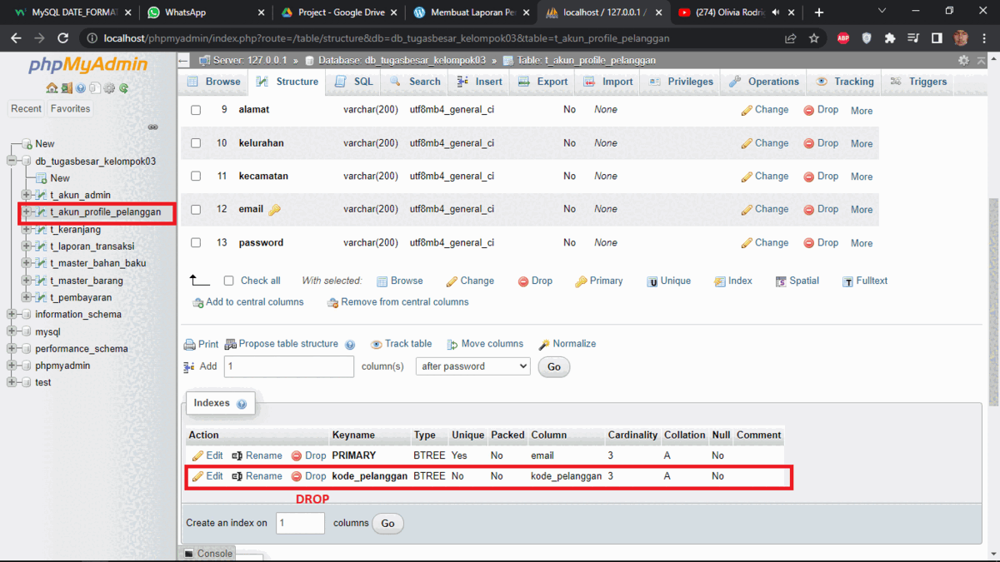

<h1 align="center">
  Tugas Besar ALGO 2
</h1>

<h4 align="center">Program Aplikasi Kedai Cartin Food</h4>





## Sekilas

Program aplikasi kedai Cartin Food ini dibangun untuk memenuhi tugas besar Algorima dan Pemrograman 2 Sekolah Tinggi Teknologi Bandung. Program aplikasi ini menggunakan bahasa Java berbasis GUI dan menggunakan database MySQL.

## Cara Penggunaan

Buat database terlebih dahulu dengan nama:
```bash
db_tugasbesar_kelompok03
```
Kemudian import database. Database telah di sediakan di dalam source code, dapat di lihat di:
[db_tugasbesar_kelompok03.sql](Penting/db_tugasbesar_kelompok03.sql)

#### Penting!!
Setelah database di import harap hapus beberapa bagian seperti pada gambar di bawah ini:


Untuk menjalankan program aplikasi ini, hal yang harus dilakukan yaitu dengan menjalankan file java ini:
[FormPilihanAplikasi.java](src/FormGUI/FormPilihanAplikasi.java)


